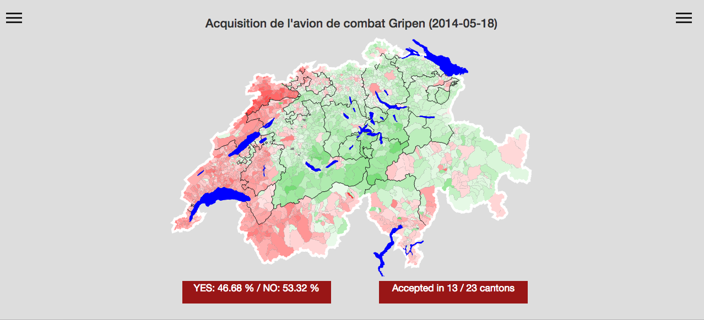
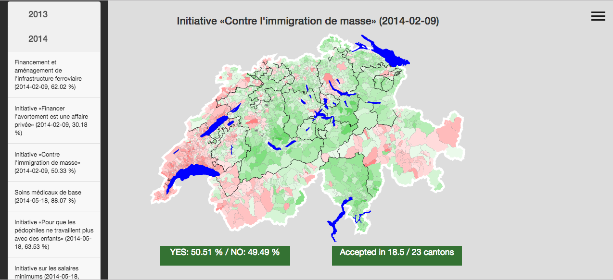
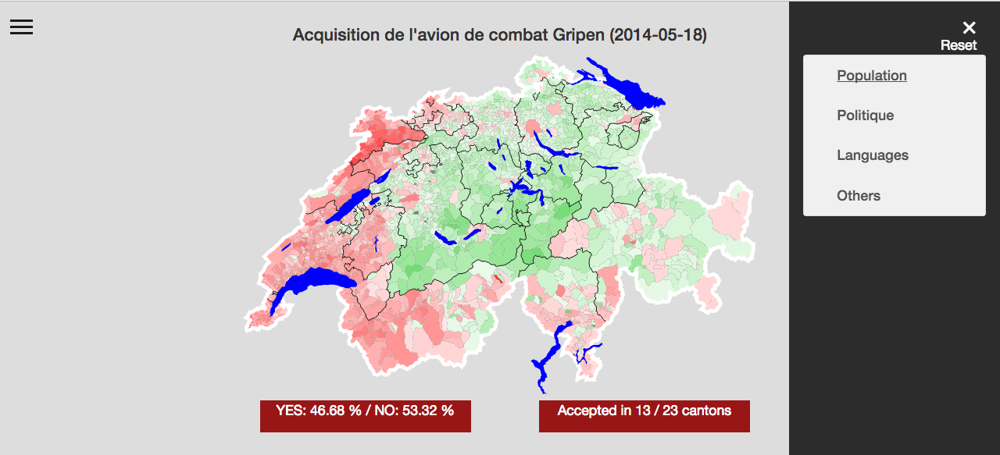
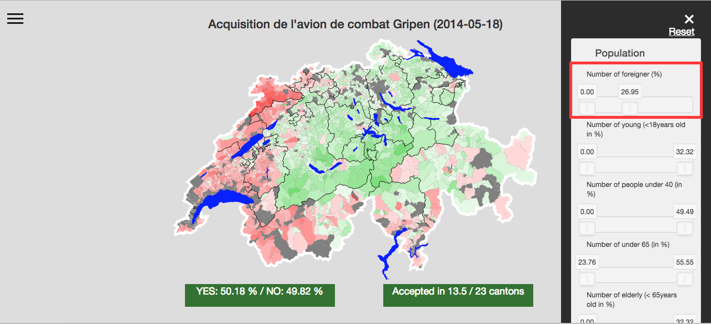
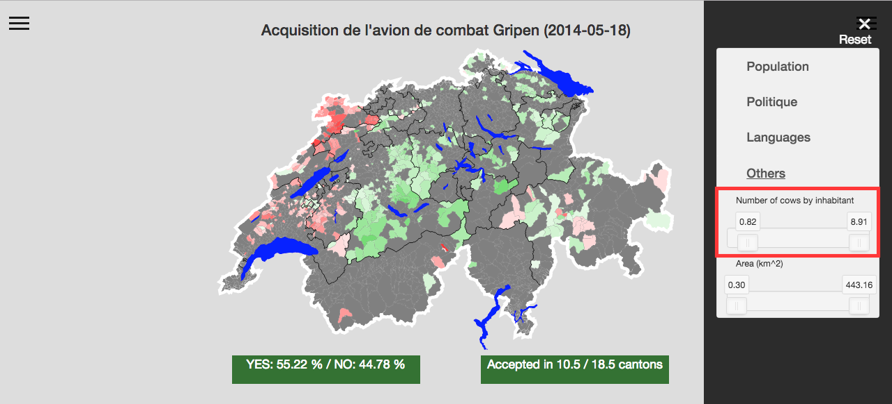

# Popular vote Visualisation

## Abstract
This project was done during the EPFL course Applied Data Analysis.

In Switzerland, each swiss citizen older that 18 years old can vote several times by year on different referendums and initiatives. To pass, one referendum must get the majority of the population and also be accepted in the majority of the cantons.

What is the impact of municipalities with more than 50% foreigners on the results of different referendums in Switzerland?

We want to build a tool to visualise the result of a referendums in each municipality. The user will have the ability to remove municipalities with certain attributes to see the impact they have on the outcome of the referendum. She will be able to see the impact of the municipality with more that 10'000 inhabitants or the impact of the one with more men than women ...
The visualisation should be 'general-purpose'. That means any data that is available for all municipalities can be added and used to filter the municipalities.


## Run the visualisation

1. Install node js
2. Install npm
3. Run the server
```
node_modules/http-server/bin/http-server -p 8008
```
4. Follow the generated link
5. Go to 'visualisation/visualisation.html'

## Visualisation
The home page looks like that


On the left side we can find all the popular vote from 2013 until 2016



When we select a vote, we can observe the result in each municipalities (green -> yes, red -> no). And on the right side of the website we can find a list of parameters of the municipalities.



Each menu contains a list of sliders that allow the user to select a group of municipalities that respect all the criterias of the sliders. Then the result is computed like if only those municipalities existed during the vote (some canton may not be represented any more). To be accepted, the vote must have the double majority: absolute majority among citizen and absolute majority among canton (both rectangle at the bottom must be green)

We can see that sliders can change the outcome of a vote. Here for example we selected only municipalities with at most 27% of foreigners in the municipalities.



Or with the number of cows by inhabitants we can see that the outcome also changes (at least 0.82 cows by inhabitants)




## Data used
The data used in this project can be found under following links.
  - [Initiatives and referendum results for each municipality](https://www.bfs.admin.ch/bfs/de/home/statistiken/politik.html)
  - [municipality mergings](http://www.portal-stat.admin.ch/gde-tool/core/xshared/gewo.php)
  - [Different kind of informations about municipalities: inhabitants, area, agriculture, criminality,...](https://www.pxweb.bfs.admin.ch/Default.aspx)
  - [The topojson we used for the visualisation](https://github.com/interactivethings/swiss-maps)


## Preprocessing

<!-- We found all the data on [Office Federal des Statistique](https://www.pxweb.bfs.admin.ch/Default.aspx?px_language=fr). It is possible to find a lots of data such as information Population or politique. -->


The hardest part was the 'fusions' (merging) of municipalities. Indeed fusion happen quiet often in Switzerland (for example 2324 municipalities in 2015 for 2294 in 2016).


Each time a fusion happened, the OFS applies the fusion for all data collected during the previous years. For example 2 communes A with 1000 inhabitants and B with 1000 inhabitants in 2015 and that merged into C in 2016, will never again appear in 2015 or before as A and B but as C as if they never existed. Since we were not able to find a topojson of 2016, we used one of 2015 that still contains the municipalities A and B. So our task was to find the fusion of each year and create a table that were able to decompose the fusions and then we could find the for each municipalities for each year.

The OFS has a lot of inconsistency in their data. As explained before the fusion was problematic but the worst was the fact that the fusion was not always applied or not always a the same time. Sometimes it was only with the fusion before 01.01.2016 sometimes it was before 10.04.2016 (apparently it's possible to merge in the middle of a year) and sometime the data was not updated.

The second inconsistency was the type of data. A columns of number of 'yes' for a vote could contains integer, float (with unnecessary precission such as 10.000000) or as string. Pandas was not always able to convert everything easily.


There were a lot of other smaller inconsistencies that took a long time to find. For example, in the data for the results of the votes, there was one NaN value. This lead to strange behaviour down the processing pipeline and it took a long time to find that it was a problem with the raw data.

## Visualisation

The visualisation has been made using D3. It is composed of one topojson and many slider that act like a filter on the data. When a slider is moved, all communes that do not respect the criteria of all sliders (not only the slider that moved) are dropped (color in gray) and the result of the vote is recomputed using only the municipalities selected (as if the other one never existed).

In Switzerland, to be accepted, a vote must have a double majority: absolute majority among the citizen, but also among the municipalities (the vote must have been accepted in half + 1 cantons). There are 23 full cantons and not 26, since  Basel-Stadt and Basel-Landschaft, Appenzell Ausserrhoden and Appenzell Innerrhoden, Obwalden and Nidwalden are half cantons. In our simulation it may happen that after moving the sliders, all the municipalities of a canton are dropped, in that case, the canton is also dropped for the double majority.
